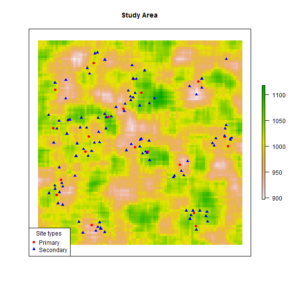

```{r setup, include=FALSE}
knitr::opts_chunk$set(echo = TRUE,
                      message = FALSE,
                      warning = FALSE)
```

## Introduction

This demo is prepared for the SAA 2017 forum at Vancouver "How to do archaeological science using R". This demo has three goals:

1. Demonstrate how to load two types of spatial data (vectors and rasters) and plot them   
2. Demonstrate data coercion into useful formats for spatial analysis    
3. Explore spatial dependency based on a) between-point interaction, b) external covariates   

For more examples of spatial stats applied to archaeological questions, see:

Riris, P. 2017.  "Towards an artefact's-eye view: Non-site analysis of discard patterns and lithic technology in Neotropical settings with a  case from Misiones province, Argentina" Journal of Archaeological Science: Reports 11 DOI: http://dx.doi.org/10.1016/j.jasrep.2017.01.002

### Loading and plotting spatial data

Suppose we have surveyed a prehistoric settlement landscape in full, and we are reasonably certain all major sites have been located by our awesome field team. We want to understand the empirical pattern in front of us, specifically how smaller sites not only outnumber, but also seem to group around larger and more important sites. How strong is this pattern? Does it hold equally across the whole study area? Can we explain the distribution of a type of site in terms of that of another?

Here are the R packages that we will need to answer these questions:

```{r load-packages}
require(spatstat) # Load packages
require(sp)
require(maptools)
require(rgdal)
require(raster)
```

With time and money limited and excavation difficult, we can't return to the field, so we have to resort to the data we have: in this case a basic distribution map! We will import our field data into R, briefly investigate it to ensure that it looks right:

```{r read-in-data-files}
main.sites <- readShapeSpatial("main.sites.shp") # Load our sites from shapefile

secondary.sites <- readShapeSpatial("secondary.sites.shp")

elev <- raster("elevation.tif") # Load elevation map

str(main.sites) # Investigate and check that the files have loaded correctly.

str(secondary.sites)
```

With the data imported and checked, we can make a simple exploratory plot:

```{r inspect-data-with-plots}
png(filename = "Sites.png", 
    width = 600, 
    height = 600, 
    units = "px")

plot(elev, 
     main = "Study Area", 
     axes = FALSE) # Inspect data

plot(main.sites, 
     col = "red", 
     pch = 16, 
     add = TRUE)

plot(secondary.sites, 
     col = "blue", 
     pch = 17, 
     add = TRUE)

legend("bottomleft", 
       title = "Site types", 
              c("Primary", "Secondary"), 
       pch = c(16, 17), 
       col = c("red", "blue"))

dev.off()

```


### Querying spatial data

For visualisation of raw patterns and classic exploratory tools we must coerce our data into a 'ppp' (planar point pattern) object for spatial statistics using the spatstat library, and then compute the intensity of the data (or 'stuff per unit area'):

```{r}
main.pp <- as.ppp(main.sites) # Coerce into 'ppp' object for spatial statistics
secondary.pp <- as.ppp(secondary.sites)

sites.pp <- superimpose(main.pp, secondary.pp)

intensity(sites.pp) # Measure intensity of different patterns
```

We can also compute the intesity for all sites together:

```{r}
allsites <- unmark(sites.pp) # removes "marks" (i.e. descriptors) from point pattern

intensity(allsites) # Intensity (points/unit of area) = 131.0494
```

This is not very informative on its own - an abstract number. Let's see if we can get more insights from additional visualisations and stats:

```{r}
d.sites <- density.ppp(sites.pp) # Overall density of all points in our data

plot(d.sites, main = "Density of all sites") # Plot interpolated values
plot(sites.pp, add = T)
```

For numeric marks (e.g. number of structures per settlement) we would use `smooth.ppp()` function. But is this informative on its own? We have two different types of site.

```{r}
par(mfrow=c(1,2)) # Set number of plotting rows to 1 and number of columns to 2
 
plot(density(main.pp), main = "Density of primary settlements")
plot(density(secondary.pp), main = "Density of satellite settlements")
```

Visualisations alone can be misleading. The patterns are clearly related, but how do we formally characterise this? First, it's important to make note of any significant spatial relationships:

```{r}
clarkevans.test(secondary.pp, correction = c("Donnelly"), nsim = 999)
```

R < 1 among secondary settlements


```{r}
clarkevans.test(main.pp, correction = c("Donnelly"), nsim = 999) 
```

R > 1 among primary sites, but not significant

Tentative conclusion: there are two different processes creating the observed distribution of sites

```{r echo = FALSE, eval = FALSE}
# NOT RUN clarkevans.test(sites.pp, correction=c("Donnelly"), nsim=999) # Obviously, the whole pattern clusters
```

### Exploring spatial relationships

More formally, we can state our null hypothesis as: Primary and secondary sites are realisations of two independent point processes (different cultural strategies?)

A point process is simply a process (random or otherwise) that generates an empirical pattern.
 
We know in this case that they are almost certainly related, but it is always worthwhile to go through the motions in case of anything unexpected cropping up.

A good place to start is bivariate spatial statistics such as the bivariate pair-correlation function. It tests for clustering or dispersion between two point patterns, i.e. the influence of one on the other.

The "classic" pair-correlation function and its ancestor Ripley's K are both univariate, but still worth using. However, here, we focus on interaction and dependency between two site-types.

```{r}
plot(pcfcross(
  sites.pp, 
  divisor = "d", 
  correction = "Ripley"), 
  main = "Bivariate pair-correlation function")
```

Empirical pattern obviously differs greatly from function under spatial randomness: `g(pois)`, but how greatly?

We can use the same approach and simulate envelopes of significance to compare agains the empirical pattern.

```{r}
bivar <- envelope(
  fun = pcfcross, 
  sites.pp, 
  divisor = "d", 
  nsim = 99, 
  correction = c("Ripley")
  ) 

plot(bivar, main = "Pair-correlation function, with simulation envelope")
```

This function shows us the following: very strong association at short ranges (up to 10 km), but around 12 km and 16-17 km there are actually fewer secondary sites than expected. A univariate function shows  this dispersion to be present in the whole dataset. In fact, this matches the findings of the Clark-Evans NN test. 

What may have caused secondary sites to be clustered to primary sites, but primary sites to be dispersed?

```{r eval = FALSE, echo = FALSE}

#NOT RUN - the two point patterns, separately

plot(main = "Univariate", 
     envelope(fun = pcf, 
              sites.pp, 
              divisor = "d", 
              nsim = 99, 
              correction = c("Ripley")
     )
)

#plot(main="Primary", envelope(fun=pcf, primary, divisor="d", nsim=99, correction=c("Ripley")))
#plot(main="Secondary", envelope(fun=pcf, secondary, divisor="d", nsim=99, correction=c("Ripley")))
```

Now we know: a) the distribution of sites varies in space, b) the presence of one type of site is tied to the presence of another.

We can now take the step from exploratory spatial analysis to confirmatory.

### Point process modelling

Define a spatstat window object for primary sites, and compute a kernel density estimate of primary settlement sites, to act as covariate, then fit point process model with the covariate:

```{r}
pwin <- as.owin(c(-0.1, 1.1, -0.1, 1.1)) # 

main.pp$window <- pwin # Assign window

pden <- density(main.pp) # Kernel density estimate of primary settlement sites, to act as covariate

fit.sec <- ppm(unmark(secondary.pp), ~ Cov1, covariates = list(Cov1 = pden)) # Fit point process model with the covariate
```

This appears to be somewhat acceptable model; locations of secondary sites seem to depend on those of primary sites. But how good is this fit?

```{r}
png(filename = "density.png", width = 600, height = 600, units = "px")

plot(predict(fit.sec), 
     main="Predicted distribution of secondary settlements", 
     col = rainbow(255))

points(secondary.pp) # Appears to be somewhat acceptable model;
                  # locations of secondary sites seem to depend
                  # on those of primary sites! But how good is this fit?

dev.off()
```


The Residual K function indicates that the locations of satellite settlements, although spatially autocorrelated with the principal settlements, are poorly explained by using only this covariate. Although a good fit is found between ~ 14 and ~18 km (the purple lines), at scales above and below this narrow band there is both significantly more dispersion and clustering, respectively. What may explain this statistical pattern?

```{r fig.show='hold'}
fit.res <- envelope(
  fun = Kres, 
  secondary.pp, 
  model = fit.sec, 
  nsim = 19, 
  correction = c("Ripley")) # Examine 

par(mfrow = c(1,2)) # Plot with two columns

png(filename = "statplot.png", width = 600, height = 600, units = "px")

plot(fit.res, main="Residual K")

abline(v = 0.14, col = "purple")
abline(v = 0.18, col = "purple")

plot(predict(fit.sec), main = "Predicted distribution", col = rainbow(255))
points(secondary.pp)

dev.off()

plot(fit.res, main = "Residual K")

abline(v = 0.14, col = "purple")
abline(v = 0.18, col = "purple")

plot(predict(fit.sec), main = "Predicted distribution", col = rainbow(255))
points(secondary.pp)
```


### Summary

This exercise invites us to: 

a) Think critically about the relationships we think we see in our data,      
b) Formalise our hypotheses about the archaeological record and test them,     
c) Pursue further data collection and analysis when we are proven wrong.    


```{r eval = FALSE, echo = FALSE}
### HOW TO GENERATE THE DATA IN THIS DEMO ###

require(spatstat) # Load packages
require(sp)
require(maptools)
require(rgdal)
require(raster)

set.seed(420) # ~*Reproducibility*~

## Vectors

X <- rNeymanScott(15, 0.2, nclust, radius=0.08, n=5) # Generate Neyman-Scott Cluster process, arbitrarily, looks nice
Y <- attr(X, "parents") # Extract the parent points
Z <- Y[X$window] # Clip parent points to window of Y

main.sites <- setmarks(Z, "Primary") # Assign the extracted parent points the mark "Primary"
marks(main.sites) <- factor("Primary")

secondary.sites <- setmarks(X, "Secondary") # Assign the simulated parent points the mark "Secondary"
marks(secondary.sites) <- factor("Secondary") 

arch.sites <- superimpose(main.sites, secondary.sites) # Join into a single marked multitype point pattern for now

plot(arch.sites, cols=c("blue", "red"), pch=c(16, 17)) # Inspect your data, fool

## Raster

# This code generates a random raster with autocorrelation to serve as a fake elevation map

r <- raster(ncols=100, nrows=100, xmn=-0.1, xmx=1.1, ymn=-0.1, ymx=1.1) # Sets dimensions of raster
r[] <- runif(ncell(r), min=500, max=1500)  # Sets range of raster values, again, arbitrarily

# Gaussian Kernel Function, brazenly stolen from a StackOverflow thread
GaussianKernel <- function(sigma=s, n=d) {
  m <- matrix(nc=n, nr=n)
  col <- rep(1:n, n)
  row <- rep(1:n, each=n)
  x <- col - ceiling(n/2)
  y <- row - ceiling(n/2)
  m[cbind(row, col)] <- 1/(2*pi*sigma^2) * exp(-(x^2+y^2)/(2*sigma^2))
  m / sum(m)
}

elev <- focal(r, w=GaussianKernel(sigma=5, n=9)) # These are arbitrary numbers, change to whatever suits you

## Save simulated data

writeRaster(elev, filename="elevation.tiff", format="GTiff") # Rasters are easy!

archspat.main <- as.SpatialPointsDataFrame.ppp(main.sites) # 'ppp' objects aren't...
archspat.sec <- as.SpatialPointsDataFrame.ppp(secondary.sites)

writeOGR(archspat.main, dsn=".", "main.sites", driver="ESRI Shapefile")
writeOGR(archspat.sec, dsn=".", "secondary.sites", driver="ESRI Shapefile")
```


