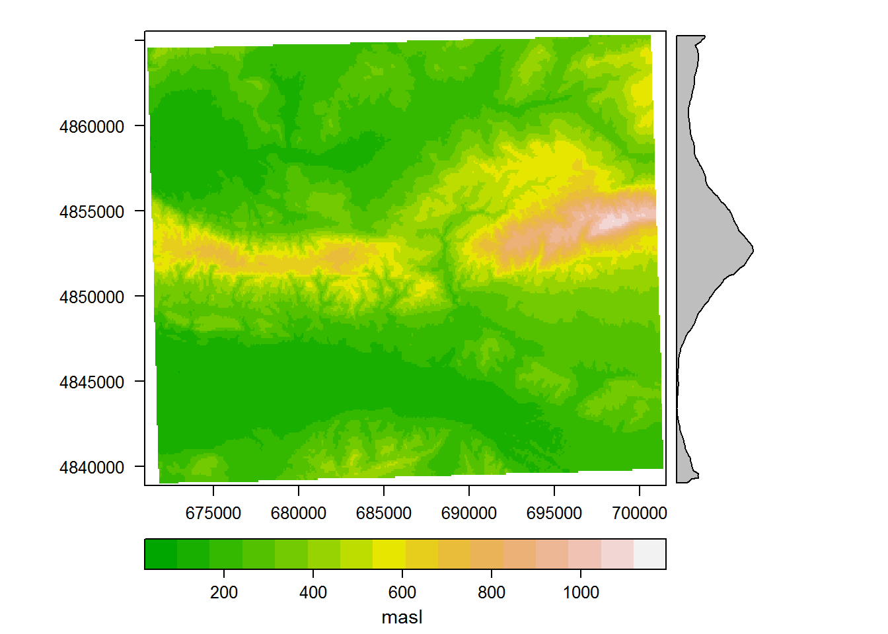
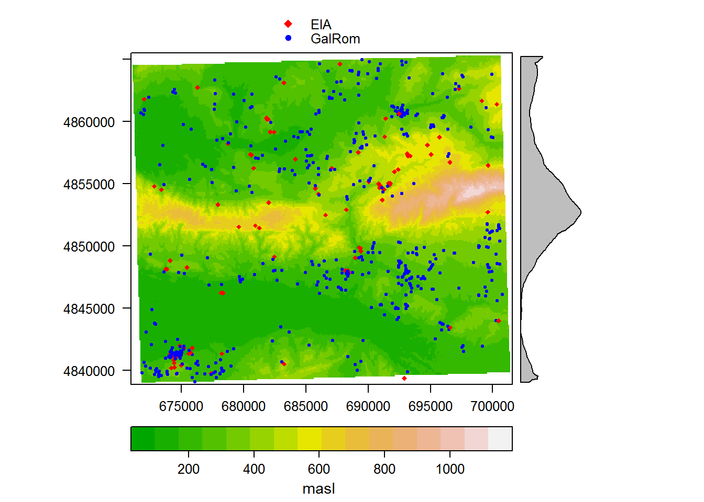
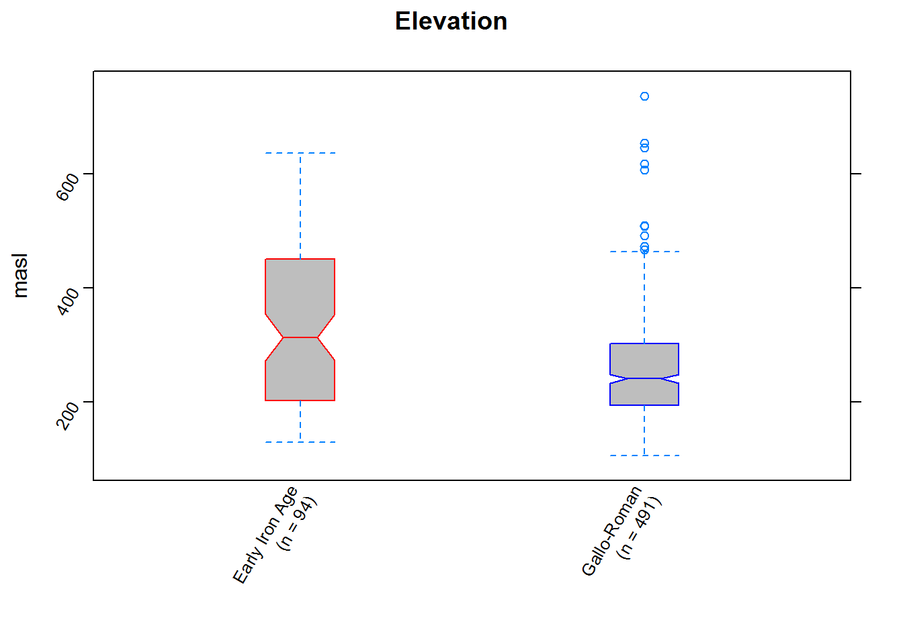
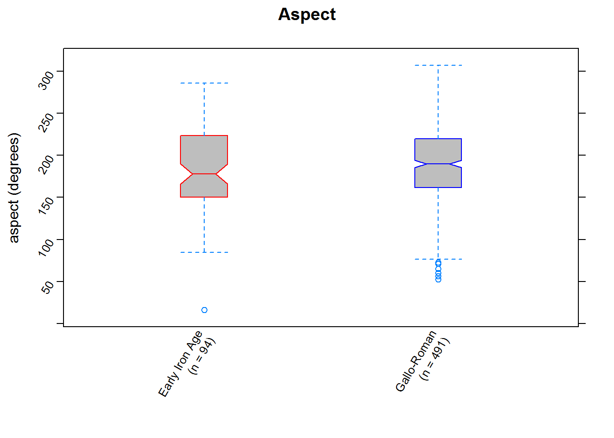
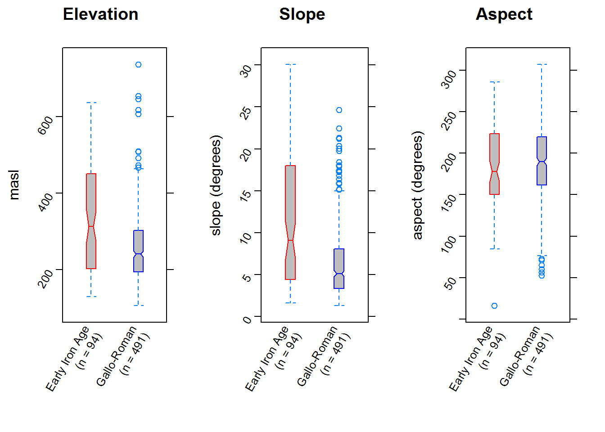

# Using R as a GIS: working with raster and vector data

Daniel Contreras


### Introduction

A common GIS task in archaeology is that of relating raster and vector data - e.g., relating site locations to environmental variables such as elevation, slope, and aspect.  It's common to do this by calculating values for the point locations in a shapefile of sites, and often of interest to compare environmental variables across some aspect of site variability - function, time period, size, etc.  Here we'll take a slightly more robust approach that looks at the areas around sites rather than their precise locations, calculating a buffer around each site location and then averaging the values of multiple environmental variables within those buffers.  For simplicity we'll use a DEM and rasters of slope and aspect that we can derive from it, but any other raster data could also be employed.  Using a fictionalized dataset for a small area in Provence, we'll take a look at some tools for exploring spatial data, and show that the areas settled in the Early Iron Age and the Gallo-Roman Period were significantly distinct with respect to some variables, but similar in others.

We might hypothesize, for instance, that the Roman colonization of the area was based on cereal agriculture production for export, and that as a result Gallo-Roman period settlement would have prioritized relatively low, flat land appropriate for such activity.  We could test this hypothesis by comparing the areas occupied in the two periods with respect to elevation and slope.

#### First Steps: Data Import and Format

We'll begin by loading a few packages...


```r
# getting started: load necessary packages
require(rgdal)
require(raster)
require(rasterVis)
require(lattice)
```

...and then importing and examining the data.


```r
#  	Import data - first a 30m DEM from NASA SRTM data (http://doi.org/10.5067/MEaSUREs/SRTM/SRTMGL1N.003) in geotiff format (though raster() will read any format that rgdal::readGDAL() recognizes), and then a point shapefile (a standard ESRI .shp, though rgdal::readOGR() can import many other sorts of spatial data also). 

# commands: raster::raster(), rgdal::readOGR() 
areaDEM <- raster("demo_files/areaDEM.tif")  # read raster

areaDEMutm <- projectRaster(areaDEM, 
                            crs="+proj=utm +zone=31 +datum=WGS84 +units=m +no_defs +ellps=WGS84 +towgs84=0,0,0") # It will be easier to work with projected data, so we'll project this to UTM using the appropriate proj4 string (http://proj4.org/index.html) for the CRS (Coordinate Reference System) that we want.

areaDEMutm  # Have a quick look at this to make sure nothing has gone terribly wrong - with the raster package loaded typing the name of a raster object will give you summary data about that object.
```

```
## class       : RasterLayer 
## dimensions  : 862, 1372, 1182664  (nrow, ncol, ncell)
## resolution  : 22.3, 30.9  (x, y)
## extent      : 670963.1, 701558.7, 4838878, 4865514  (xmin, xmax, ymin, ymax)
## coord. ref. : +proj=utm +zone=31 +datum=WGS84 +units=m +no_defs +ellps=WGS84 +towgs84=0,0,0 
## data source : in memory
## names       : areaDEM 
## values      : 91.62182, 1121.591  (min, max)
```

```r
sites <- readOGR(dsn="demo_files", layer="areaPoints") # read .shp (note that to read a shapefile, "the data source name (dsn= argument) is the folder (directory) where the shapefile is, and the layer is the name of the shapefile (without the .shp extension)" (from the rgdal::readOGR documentation))
```

```
## OGR data source with driver: ESRI Shapefile 
## Source: "demo_files", layer: "areaPoints"
## with 1061 features
## It has 3 fields
## Integer64 fields read as strings:  ID
```

```r
sites_sub <- sites[sites$period == "EIA" | sites$period == "GalRom",]  # subset points to eliminate sites of uncertain date - i.e., select from 'sites' only those rows in which the 'period' column is "EIA" or "GalRom".

sites_sub$period <- factor(sites_sub$period) # drop unused levels (not strictly necessary but will avoid messiness when plotting data later)

sites_sub_utm <- spTransform(sites_sub, 
                             "+proj=utm +zone=31 +datum=WGS84 +units=m +no_defs +ellps=WGS84 +towgs84=0,0,0") # project points to UTM 

sites_sub_utm  # Check the file (note that it is now a Spatial Points Data Frame, and typing its name will give you an object summary).  Note that there is a 'type' field that we won't work with here, but which could be incorporated into this kind of analysis, e.g., by further sub-setting or by grouping data when boxplotting.
```

```
## class       : SpatialPointsDataFrame 
## features    : 585 
## extent      : 671788.9, 700793.6, 4839110, 4864963  (xmin, xmax, ymin, ymax)
## coord. ref. : +proj=utm +zone=31 +datum=WGS84 +units=m +no_defs +ellps=WGS84 +towgs84=0,0,0 
## variables   : 3
## names       : period,     type, ID 
## min values  :    EIA, domestic,  1 
## max values  : GalRom,    other, 99
```

#### Working with a DEM

We can use the DEM to calculate DEM derivatives.


```r
# 

# commands: raster::terrain() 

area_slope <- terrain(areaDEMutm, opt = 'slope', unit = 'degrees')  #calculate slope

area_aspect <- terrain(areaDEMutm, opt = 'aspect', unit = 'degrees') #calculate aspect

#Have a quick look at these to see that the results make sense - they are now raster objects just like areaDEM and can be examined the same way.
area_slope
```

```
## class       : RasterLayer 
## dimensions  : 862, 1372, 1182664  (nrow, ncol, ncell)
## resolution  : 22.3, 30.9  (x, y)
## extent      : 670963.1, 701558.7, 4838878, 4865514  (xmin, xmax, ymin, ymax)
## coord. ref. : +proj=utm +zone=31 +datum=WGS84 +units=m +no_defs +ellps=WGS84 +towgs84=0,0,0 
## data source : in memory
## names       : slope 
## values      : 0, 64.11368  (min, max)
```

```r
area_aspect
```

```
## class       : RasterLayer 
## dimensions  : 862, 1372, 1182664  (nrow, ncol, ncell)
## resolution  : 22.3, 30.9  (x, y)
## extent      : 670963.1, 701558.7, 4838878, 4865514  (xmin, xmax, ymin, ymax)
## coord. ref. : +proj=utm +zone=31 +datum=WGS84 +units=m +no_defs +ellps=WGS84 +towgs84=0,0,0 
## data source : in memory
## names       : aspect 
## values      : 0, 360  (min, max)
```

Those summaries are useful, but let's also plot our raster DEM; this is not strictly necessary, but it's reassuring to see that the data are meaningful.  We won't try to make the plot too pretty; the options specified do just enough to plot it as an intelligible terrain DEM.

#### Raster and Point Plotting


```r
#

# commands: rasterVis::levelplot(), it's also a function in the lattice pkg, so let's specify the namespace just to be sure we are using the right function 
rasterVis::levelplot(areaDEMutm,
          margin = list(x = FALSE, 
                        y = TRUE),
  col.regions = terrain.colors(16),
  xlab = list(label = "", 
              vjust = -0.25),
  sub = list(
    label = "masl",
    font = 1,
    cex = .9,
    hjust = 1.5))
```



We can check that our data occupy the same space, and visually assess our hypothesis, by plotting the raster with the sites overlain as points, varying color and shape by period.  Since this is just for exploratory purposes, we won't worry about making it too pretty.


```r
# commands: sp::spplot() 
rasterVis::levelplot(areaDEMutm,
  margin = list(x = F, 
                y = T),
  col.regions = terrain.colors(16),
  xlab = list (label = "", 
               vjust = -.25),
  sub = list(
    label = "masl",
    font = 1,
    cex = .9,
    hjust = 1.5),
  key = list(       #this time we'll include a legend that identifies the points we'll plot
    space = "top",
    points = list(
      pch = c(18,20),
      col = c("red","blue")), 
    text = list(
      c("EIA","GalRom"),
      cex=.8))
  ) + 
  spplot(sites_sub_utm, # add a layer of points
         zcol = "period", 
         cex = .6,
         pch = c(18,20),
         col.regions = c("red","blue")
         )  
```



Satisfied that our data make sense, and perhaps already having developed some ideas about site distribution just by staring at the map, we can move on to explore the site locations analytically. We'll begin by building a raster stack that consists of the rasters of the three variables we'll examine: elevation, slope, and aspect.  

#### Raster Stacks


```r
# commands: raster::stack()
terrainstack <- stack(areaDEMutm, 
                      area_slope, 
                      area_aspect)

terrainstack # have a quick look at resulting object, which shows the number of layers and the min/max values we expect
```

```
## class       : RasterStack 
## dimensions  : 862, 1372, 1182664, 3  (nrow, ncol, ncell, nlayers)
## resolution  : 22.3, 30.9  (x, y)
## extent      : 670963.1, 701558.7, 4838878, 4865514  (xmin, xmax, ymin, ymax)
## coord. ref. : +proj=utm +zone=31 +datum=WGS84 +units=m +no_defs +ellps=WGS84 +towgs84=0,0,0 
## names       :    areaDEM,      slope,     aspect 
## min values  :   91.62182,    0.00000,    0.00000 
## max values  : 1121.59056,   64.11368,  359.99998
```

#### Using extract() to selectively summarize raster data

We can then take that raster stack and use extract() to summarize values of DEM, slope, and aspect within a buffer around each point.


```r
# commands: raster::extract()
sites_vals <- extract(terrainstack,
                      sites_sub_utm,
                      buffer = 250,
                      fun = mean,
                      sp = TRUE) # extract the mean values w/in a 250m radius around each site for each terrain variable
```

The results can be examined in any number of ways; here we'll make boxplots for each of the variables of interest. We'll plot each variable by period, so each result will comprise two box-and-whisker plots, one for the Early Iron Age and one for the Gallo-Roman Period

#### Boxplotting for exploratory data analysis

As with the exploratory raster-and-point plotting we did above, we won't worry too much about making these plots pretty; we'll just do enough to make them easily visually intelligible.  I'm using the lattice package for the plotting, but there are several other ways to do this as well.  Something that we *won't* get into here because it adds a layer of complication is to also characterize the environmental background - i.e., to assess the question of whether settlement locations comprise a random sample of the the available landscape or instead focus on certain kinds of locations.  


```r
# commands: summary(), lattice::bwplot()

summary(sites_vals$period)#check the sample size for each period (I've done this and manually incorporated it in the boxplot labels)
```

```
##    EIA GalRom 
##     94    491
```

```r
elevplot <- bwplot(areaDEM ~ period,   # Here we're writing the boxplot to an object for later use (if you just want to display it, simply run the code without writing to an object)
                   data = data.frame(sites_vals), 
                   notch = TRUE, 
                   pch = "|", 
                   fill = "grey", 
                   box.ratio = 0.25, 
                   par.settings = list(
                     box.rectangle = list(
                       col = c("red","blue"))),  #to maintain a visual link to our map, we'll plot the box outlines with the same color scheme
                   ylab = "masl", 
                   main="Elevation",
                   scales = list(x = list(labels = c("Early Iron Age\n(n = 94)",
                                                     "Gallo-Roman\n(n = 491)")),
                                 rot=60)) 
elevplot  #examine the result to make sure everything is in order
```



```r
#repeat for slope 
slopeplot <- bwplot(slope ~ period,  
                    data = data.frame(sites_vals), 
                    notch = TRUE, 
                    pch = "|", 
                    fill = "grey", 
                    box.ratio = 0.25, 
                    par.settings = list(
                     box.rectangle = list(
                       col = c("red","blue"))),
                    ylab = "slope (degrees)",
                    main = "Slope", 
                    scales = list(x = list(labels = c("Early Iron Age\n(n = 94)",
                                                     "Gallo-Roman\n(n = 491)")),
                                  rot = 60))
# view the plot
slopeplot
```


```r
#and then aspect
aspectplot <- bwplot(aspect ~ period, 
                     data = data.frame(sites_vals), 
                     notch = TRUE, 
                     pch = "|", 
                     fill = "grey", 
                     box.ratio = 0.25, 
                     par.settings = list(
                     box.rectangle = list(
                       col = c("red","blue"))),
                     ylab = "aspect (degrees)", 
                     main = "Aspect", 
                     scales = list(x = list(labels = c("Early Iron Age\n(n = 94)",
                                                     "Gallo-Roman\n(n = 491)")),
                                   rot=60))
# view the plot
aspectplot
```



We can already assess our hypothesis by looking at those plots individually, but since we've written them to objects we can also easily juxtapose them in a single plot and consider the results. 


```r
# a bonus plotting problem: putting all three of these in one plot
#commands: gridExtra::grid.arrange 
require(gridExtra)
grid.arrange(elevplot, 
             slopeplot, 
             aspectplot,  
             nrow = 1, 
             ncol = 3)
```



We can now quantitatively assess whatever visual assessments we made: it's clear (the notches give a rough 95% confidence interval for the medians) that parts of the landscape of differing slope and elvation were preferred in the two periods (and, in contrast, that aspect was considered similarly or perhaps remained unimportant). 

#### Summary

What does all this mean for the archaeological question?Our hypothesis looks pretty compelling, at first glance.  There is a marked change between the Early Iron Age and the Gallo-Roman Period in the parts of the landscape preferred, and the pattern is robust.  That said, this should be seen as exploratory analysis, and common GIS caveats apply: 
  
* the variables we're looking at hardly comprise an exhaustive list,   
* there's perhaps some danger of ecological fallacy with categories so broad,  
* there's always some risk that some other variable that is related to - or at least covaries with - those we've examined is _actually_ the causal one,  
* issues like data quality and landscape taphonomy ought to be considered,  
* we are privileging environmental variables because that data is easily available,  
* etc.   
  
However, those are problems of argument construction more than of method, and I find this a powerful set of tools with which to explore data and think about which arguments to test in more detail. Such issues might be addressed by further exploring the data (e.g., exploring other site variables, varying the buffer size, varying the summary statistics use to describe the landscape within the buffer), adding other data (e.g., rasters of distance-from-streams, soil type and depth, etc.), and thinking about what it would take to build a more robust argument.  


Finally, by way of considering what we might gain by using R as a GIS in this way (rather than QGIS, ArcGIS, etc) I want to highlight four of the steps we've gone through:   

  1. subsetting data    
  2. adding environmental (or any spatial) variables as raster data and summarizing them with respect to site locations    
  3. specifying analytical parameters (e.g., buffer size, summary statistics)
  4. visualising the distributions of environmental variables for the sites    
  
All of these provide flexibility in the particulars of the analysis, and the entire process is easily repeatable in varying permutations or with different data.


```r
sessionInfo()
```

```
## R version 3.3.3 (2017-03-06)
## Platform: x86_64-w64-mingw32/x64 (64-bit)
## Running under: Windows 7 x64 (build 7601) Service Pack 1
## 
## locale:
## [1] LC_COLLATE=English_Australia.1252  LC_CTYPE=English_Australia.1252   
## [3] LC_MONETARY=English_Australia.1252 LC_NUMERIC=C                      
## [5] LC_TIME=English_Australia.1252    
## 
## attached base packages:
## [1] methods   stats     graphics  grDevices utils     datasets  base     
## 
## other attached packages:
## [1] gridExtra_2.2.1     rasterVis_0.41      latticeExtra_0.6-28
## [4] RColorBrewer_1.1-2  lattice_0.20-34     raster_2.5-8       
## [7] rgdal_1.2-5         sp_1.2-4           
## 
## loaded via a namespace (and not attached):
##  [1] Rcpp_0.12.10      knitr_1.15.17     magrittr_1.5     
##  [4] viridisLite_0.2.0 stringr_1.2.0     tools_3.3.3      
##  [7] parallel_3.3.3    grid_3.3.3        gtable_0.2.0     
## [10] htmltools_0.3.5   yaml_2.1.14       rprojroot_1.2    
## [13] digest_0.6.12     bookdown_0.3.16   evaluate_0.10    
## [16] rmarkdown_1.4     stringi_1.1.3     backports_1.0.5  
## [19] hexbin_1.27.1     zoo_1.7-14
```

